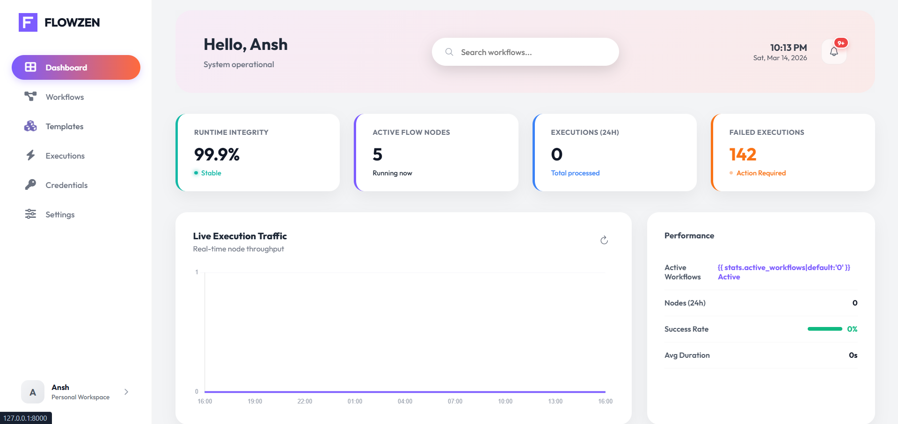
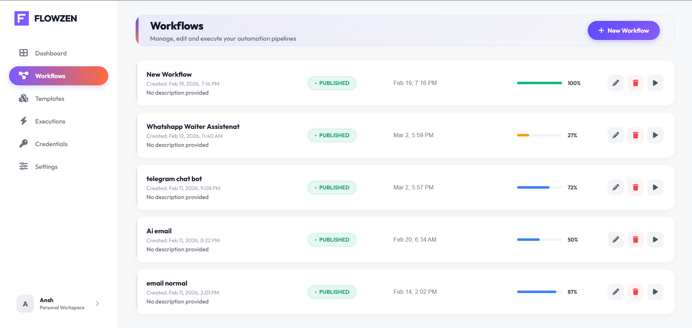
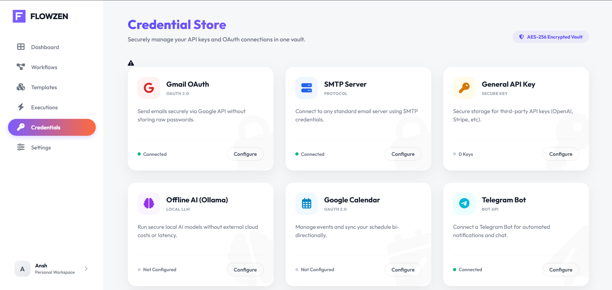
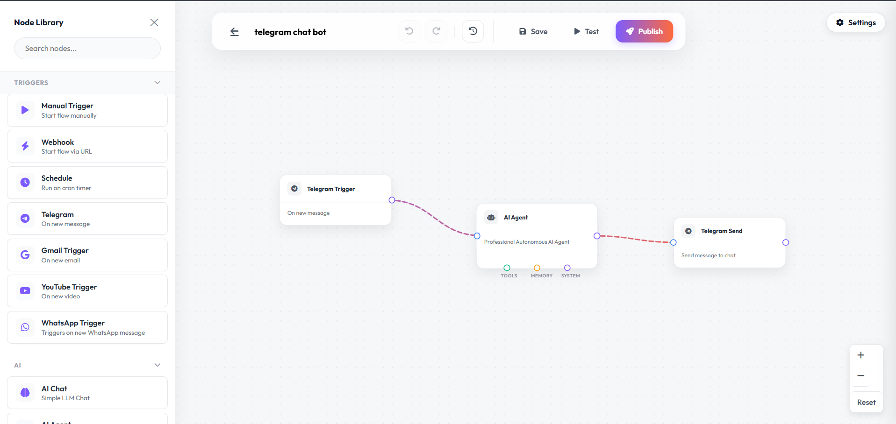
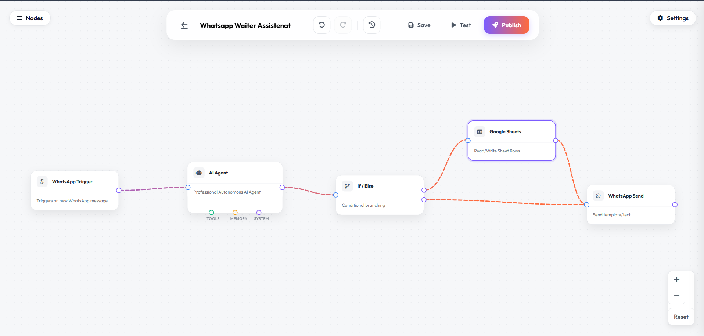
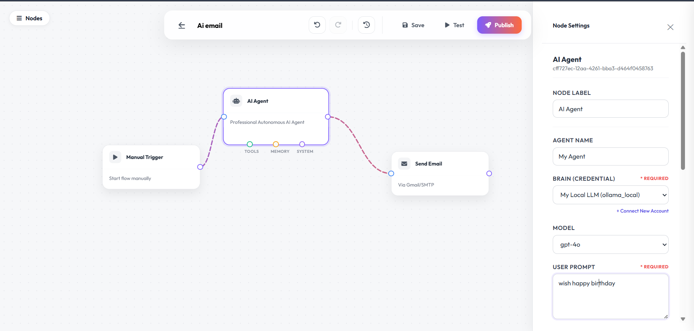
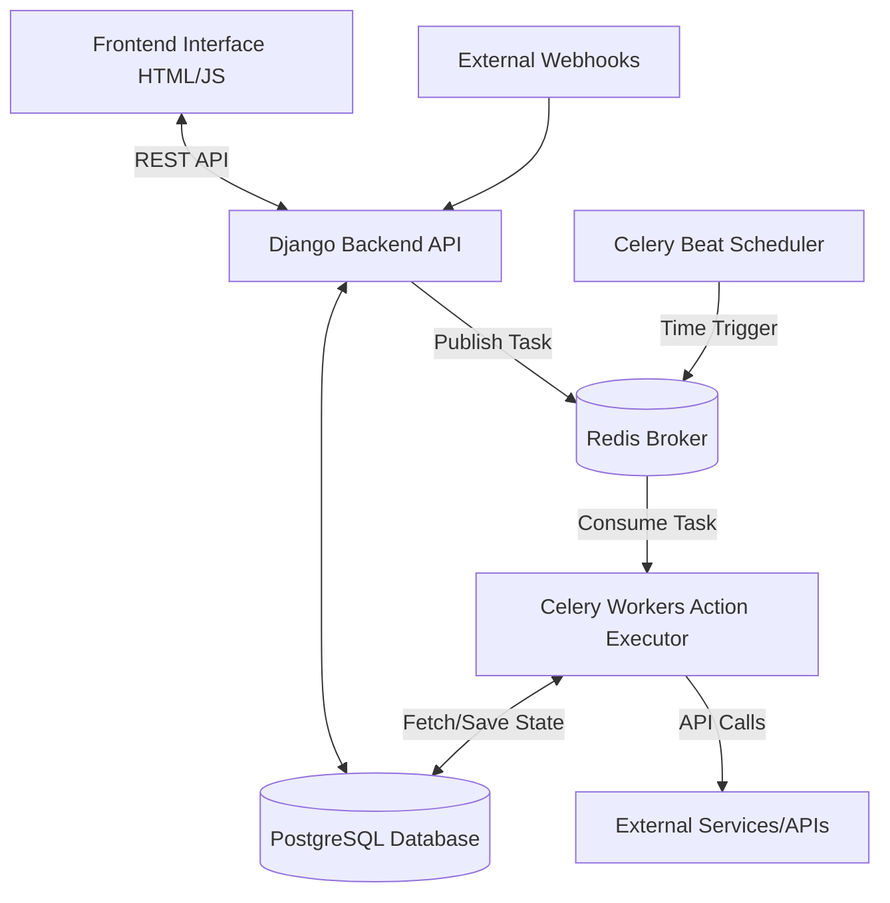
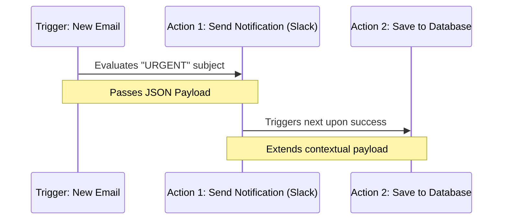

# ⚡ FlowZen – Workflow Automation Platform

[](https://opensource.org/licenses/MIT)
[](https://www.python.org/downloads/release/python-3100/)
[](https://www.djangoproject.com/)
[](https://docs.celeryq.dev/en/stable/)
[](https://hub.docker.com/r/yourusername/flowzen)
[](http://makeapullrequest.com)
[]()
[](https://github.com/psf/black)

**Build logic once. Automate natively. Stay in control.**

FlowZen is a complete system for orchestrating, scheduling, and automating operations across your entire technology stack. Say goodbye to closed-ecosystem SaaS limitations and per-task pricing, and hello to complete data autonomy with an open-source automation engine built for scale.

---

## 📑 Table of Contents

- [Project Description](#-project-description)
- [Key Features](#-key-features)
- [Screenshots](#-screenshots-section)
- [Demo / Preview](#-demo--preview)
- [Tech Stack](#-tech-stack)
- [System Architecture](#-system-architecture)
- [Folder Structure](#-folder-structure)
- [Quick Start](#-quick-start)
- [Installation Guide](#-installation-guide)
- [Development Setup](#-development-setup)
- [How to Run the Project](#-how-to-run-the-project)
- [Deployment Guide](#-deployment-guide)
- [How to Use FlowZen](#-how-to-use-flowzen)
- [Example Workflow](#-example-workflow)
- [API Usage](#-api-usage)
- [Configuration](#-configuration)
- [Security Notes](#-security-notes)
- [Performance Notes](#-performance-notes)
- [Troubleshooting](#-troubleshooting)
- [FAQ](#-faq)
- [Future Improvements](#-future-improvements)
- [Contributing](#-contributing-section)
- [License](#-license)
- [Author](#-author)

---

## 📖 Project Description

**FlowZen** is a powerful, open-source workflow automation platform designed to seamlessly connect your favorite apps, APIs, and databases. Much like popular platforms such as **n8n**, **Zapier**, and **Make**, FlowZen enables you to build automated pipelines that execute actions based on specific triggers—all without needing to write repetitive integration code.

FlowZen solves the problem of manual, repetitive tasks by allowing developers and businesses to orchestrate complex operations visually and programmatically. Whether you are syncing data between SaaS applications, handling webhooks, scheduling cron jobs, or saving form submissions into a database, FlowZen provides a reliable, self-hosted alternative to expensive managed automation solutions.

### 🌟 How it compares:
- **vs Zapier:** FlowZen is self-hosted, highly customizable, and gives you complete data ownership without expensive task-based pricing tiers.
- **vs Make:** Offers a more developer-centric approach with deeper underlying Python/Django customizability while maintaining a user-friendly configuration layer.
- **vs n8n:** Developed natively in Python (Django) rather than Node.js, making it exceptionally easy to extend for teams already working within the Python ecosystem (Data Science, AI/ML, backend engineering).

---

## ✨ Key Features

FlowZen comes packed with powerful capabilities to handle any automation scenario you can imagine:

- 🔄 **Workflow Automation:** Create multi-step chained tasks that pass data from one node to the next.
- 🎯 **Trigger-based Execution:** Start workflows instantly via Webhooks, API calls, or app-specific events (e.g., New Email, Slack Message).
- ⛓️ **Action Pipelines:** Transform, route, and filter data seamlessly between triggers and multiple destination actions.
- 🕒 **Task Scheduling:** Integrated Celery beat scheduler allows you to run workflows on precise cron intervals (e.g., "Every day at 8 AM", "Every 15 minutes").
- 🔌 **API Integrations:** Connect to any REST or GraphQL API using flexible HTTP request nodes.
- 🗄️ **Database Storage:** Native Postgres and Redis support for fast execution, state management, and saving persistent records.
- 📝 **Logging:** Comprehensive real-time execution logs for every step, allowing you to debug and trace data payloads effortlessly.
- 🎨 **UI Workflow Builder:** An intuitive, visually-driven frontend interface to manage and construct your automation paths.
- 🛡️ **Error Handling:** Robust retry mechanisms, fallback routes, and error alerts to ensure mission-critical workflows never silently fail.
- 📜 **Automation History:** Keep a detailed audit trail of past runs, success rates, and execution durations.

---

## 📸 Screenshots Section

Here is a glimpse of the FlowZen interface:
## 📸 Screenshots

### Dashboard Overview


### Workflow Management


### Credential Store


### Telegram AI Workflow


### WhatsApp AI Workflow


### AI Email Automation


---

## 🛠️ Tech Stack

FlowZen is built on a modern, robust, and scalable technology stack:

- **Backend:** [Python 3](https://www.python.org/) & [Django](https://www.djangoproject.com/) (REST Framework) – Handles the core API, ORM, and business logic.
- **Database:** [PostgreSQL](https://www.postgresql.org/) (SQL) – For persistent storage of workflows, user data, and execution history.
- **Task Queue & Caching:** [Celery](https://docs.celeryq.dev/) & [Redis](https://redis.io/) – For asynchronous workflow execution, task brokering, and real-time state management.
- **Frontend:** HTML5, CSS3, JavaScript (Vanilla JS & Django Templates) – For a fast, lightweight, and responsive user interface.
- **Real-time Comms:** [Django Channels](https://channels.readthedocs.io/) – WebSockets support for live execution logs.
- **Infrastructure:** Docker & Docker Compose for seamless deployment and isolated environments.

---

## 🏗️ System Architecture

The architecture of FlowZen is decoupled to ensure high availability and horizontal scalability.

- **Frontend Interface:** The UI layer where users build workflows and view logs. It communicates with the backend via REST API.
- **Workflow Engine (Django):** The brain of the operation. Parses the workflow definition and breaks it down into executable tasks.
- **Trigger System:** Listens for incoming events (e.g., Webhook endpoints) and dispatches initial payloads to the Workflow Engine.
- **Action Executor (Celery Workers):** Consumes tasks from Redis and executes the actual HTTP requests, data transformations, or database queries.
- **Scheduler (Celery Beat):** Evaluates time-based triggers and injects them into the queue when due.
- **Database Layer (Postgres):** Stores workflow definitions, credentials securely (encrypted), and historical run data.

### Architecture Diagram



---
## 📘 Full Technical Documentation

A detailed technical documentation of FlowZen is available for a deeper understanding of the system architecture, workflow execution engine, integrations, and debugging case studies.

This document explains the internal design and development journey of FlowZen including:

• System architecture and execution engine design  
• Workflow graph structure and node execution rules  
• Gmail OAuth email integration  
• Telegram webhook automation system  
• Celery background workers and Redis task queue  
• AI Agent node integration using local LLM  
• Real-world debugging case studies and reliability fixes  
• Deployment architecture and local development setup  

📑 Documentation Length: 18+ pages  
🧠 Covers architecture, execution engine, integrations, debugging, and deployment.

📄 **Read the full documentation here:**  
https://github.com/Ansh972007/FLOWZEN/blob/main/docs/analysis/FlowZen_Combined_Documentation.pdf

## 📂 Folder Structure

FlowZen is organized optimally for readability and easy maintenance.

```text
FlowZen/
 ├ Automation/
 │  ├ backend/          # Django project root, settings, API endpoints, ORM models
 │  │  ├ workflows/     # Core logic for nodes, execution, and trigger handlers
 │  │  └ credentials/   # Encrypted credential management logic
 │  ├ frontend/         # HTML templates, CSS styles, and JavaScript assets
 │  └ scripts/          # Utility scripts and database migrations
 ├ docker/              # Docker configuration files and environment definitions
 ├ docs/                # Project documentation and architecture notes
 ├ requirements.txt     # Python dependencies list
 ├ docker-compose.yml   # Multi-container orchestration definition
 └ README.md            # You are here!
```

---

## ⚡ Quick Start

To instantly fire up FlowZen locally using Docker, execute the following commands in your terminal:

```bash
# 1. Clone the repository
git clone https://github.com/YourUsername/FlowZen.git
cd FlowZen

# 2. Add an environment file
cp docker/.env.example docker/.env

# 3. Start the entire platform via Docker
docker compose up -d --build

# 4. Apply migrations and create an admin user
docker compose exec backend python manage.py migrate
docker compose exec backend python manage.py createsuperuser

# 5. Access the app
```
➡️ Open your browser and go to `http://localhost:8000`. Log in with the credentials you just created.

---

## 🚀 Installation Guide

Follow these detailed steps to get FlowZen running on your local machine if you prefer a more granular setup or need more control over the components.

### Prerequisites
- [Git](https://git-scm.com/)
- [Docker](https://docs.docker.com/get-docker/)
- [Docker Compose](https://docs.docker.com/compose/install/)

### Step 1: Clone the Repository
```bash
git clone https://github.com/YourUsername/FlowZen.git
cd FlowZen
```

### Step 2: Environment Configuration
Copy the example environment file and adjust the secrets (if necessary). The default variables are designed to work perfectly out-of-the-box for local testing.
```bash
cp docker/.env.example docker/.env
```
*(Note: If an example file doesn't exist, ensure your `.env` has the necessary Postgres and Django configuration keys used in `docker-compose.yml`.)*

### Step 3: Build the Docker Containers
This command will pull Postgres, Redis, and build the Python backend environments, installing all dependencies from `requirements.txt`.
```bash
docker compose build
```

### Step 4: Database Setup & Migrations
Before starting the whole stack, you need to apply the database migrations and create a superuser.
```bash
docker compose run --rm backend python manage.py migrate
docker compose run --rm backend python manage.py createsuperuser
# Follow the prompt to set your admin email and password.
```

---

## 👨‍💻 Development Setup

If you want to contribute to the code or build Custom Nodes actively, you can set it up for hot-reloading native development without purely relying on Docker containers for the python backend logic:

1. **Start infrastructure via Docker (Postgres, Redis only):**
   ```bash
   docker compose up -d db redis
   ```
2. **Setup your dynamic virtual environment:**
   ```bash
   python -m venv venv
   source venv/bin/activate  # Or `.\venv\Scripts\activate` on Windows
   pip install -r requirements.txt
   ```
3. **Configure the local `.env`** specifically for your system (ensuring `DATABASE_HOST=localhost` and `REDIS_HOST=localhost`).
4. **Run migrations natively:**
   ```bash
   python Automation/backend/manage.py migrate
   ```
5. **Start Django Dev Server & Celery natively:**
   ```bash
   # Terminal 1
   python Automation/backend/manage.py runserver 
   
   # Terminal 2
   celery -A project worker -l info
   ```

To add a new Integration or Node: 
In `Automation/backend/workflows/nodes/`, copy the structure of an existing node to create a new integration. Ensure the frontend builder correctly renders your new node's configuration parameters.

---

## 🏃 How to Run the Project

Running the project via Docker Compose natively is incredibly simple once initial setup is done:

1. **Start the Services:**
   In your terminal, run:
   ```bash
   docker compose up -d
   ```
   *The `-d` flag runs the containers in the background.*

2. **Verify Services:**
   Check that all primary containers are running (db, redis, backend, worker, beat):
   ```bash
   docker compose ps
   ```

3. **Access the Application:**
   Open your web browser and navigate to:
   [http://localhost:8000](http://localhost:8000)

4. **Stopping the project:**
   When you're done, gracefully spin down the services:
   ```bash
   docker compose down
   ```

---

## 🌍 Deployment Guide

FlowZen is built container-first, making it ideal for deployments into production environments such as AWS EC2, DigitalOcean Droplets, or Kubernetes.

**For a single-VM Docker deployment:**
1. Provision a server (e.g., Ubuntu 22.04) and install Docker.
2. Clone the repository to the server.
3. Update `.env` with production secrets (Set `DJANGO_DEBUG=False`, implement strong database passwords, set `ENCRYPTION_KEY`).
4. **Use a reverse proxy** like Nginx or Caddy to SSL-terminate and route traffic on Port 80/443 pointing to Port 8000 container.
5. Run `docker compose up -d --build`.

*(Note: Never run Postgres with default passwords in a production-facing setup. Ensure your firewall drops public access to Ports 5432 and 6379 natively).*

---

## 🕹️ How to Use FlowZen

Using FlowZen is designed to be intuitive:

1. **Create a Workflow:** Navigate to the FlowZen dashboard and click "Create New Workflow". Give it a descriptive name.
2. **Configure Triggers:** Add a Trigger Node onto the canvas. This could be a "Webhook" trigger, an "Interval/Schedule" trigger, or a specific app integration (like Gmail). Configure its parameters.
3. **Connect Actions:** Drag an Action Node onto the canvas (e.g., "HTTP Request", "Postgres Insert"). Draw a connection line from the Trigger to the Action. Map the dynamic data from the trigger payload into the action fields using variables.
4. **Execute Automations:** Turn the workflow "Active". If it's a webhook, send a POST request to the generated URL. If it's a schedule, wait for the interval to pass.
5. **Monitor Logs:** Go to the "Executions" tab to see real-time updates. You can inspect the exact JSON input and output payload of every single node in the chain for easy debugging.

---

## 💡 Example Workflow

Here is an example scenario of how a workflow is structured and executed.

**Scenario:** Send a notification and log to a database whenever a specific email arrives.

### Data Flow Diagram



- 🎯 **Trigger: New Email Received**
  - Connects to your Gmail/IMAP account.
  - Polls for emails matching the filter: `Subject contains "URGENT"`.
  - *Data Output:* `{ "sender": "boss@company.com", "subject": "URGENT: Server Down", "body": "Fix it now." }`

- ➡️ **Action 1: Send Notification (Slack/Discord)**
  - Receives the data from the Trigger.
  - Sends a channel message: `ALERT: New urgent email from {{ trigger.sender }}`.

- ➡️ **Action 2: Save to Database**
  - Takes the original payload.
  - Connects to your internal SQL database.
  - Executes: `INSERT INTO alerts (sender, subject) VALUES ('{{ trigger.sender }}', '{{ trigger.subject }}')`.

**Step-by-step execution:** Once the email is detected, the workflow engine places Action 1 on the Celery queue. Once Action 1 succeeds, it passes state to Action 2, which then executes on the background worker. The entire flow is logged as a single "Execution Instance".

---

## 🌐 API Usage

FlowZen exposes a powerful REST API so you can programmatically manage workflows. 

**Authentication:** 
Currently relies on Django Session/Token authentication.

**Example Endpoints:**

- `GET /api/workflows/`
  *Returns a list of all workflows and their active/inactive status.*

- `POST /api/workflows/<id>/execute/`
  *Manually trigger a specific workflow run, bypassing standard triggers. Useful for testing.*
  ```json
  // Request Body Payload
  {
    "mock_data": {
      "key": "value"
    }
  }
  ```

- `GET /api/executions/<run_id>/`
  *Fetch the detailed logs and block-by-block performance data of a specific run.*

---

## ⚙️ Configuration

FlowZen can be heavily customized using Environment Variables (`.env`). Key configurations include:

| Variable | Description | Default |
|----------|-------------|---------|
| `DJANGO_DEBUG` | Enables detailed error pages. Set to `False` in production. | `True` |
| `DJANGO_SETTINGS_MODULE` | The settings path. | `project.settings` |
| `DATABASE_URL` | Postgres connection string. | `postgres://user:pass@db:5432/db`|
| `REDIS_HOST` | Hostname of the Redis instance. | `redis` |
| `CELERY_BROKER_URL` | Task queue broker URI. | `redis://redis:6379/0` |
| `SECRET_KEY` | Django cryptographic secret. | *(Must be generated)* |
| `ENCRYPTION_KEY` | Key for encrypting OAuth tokens in database. | *(Must be generated)* |

---

## 🔒 Security Notes

- **Credentials Encryption:** FlowZen automatically encrypts 3rd-party OAuth credentials and passwords at rest internally using your `ENCRYPTION_KEY` using AES-GCM or Fernet encryption natively.
- **SSRF Protections:** Be aware that FlowZen HTTP Request nodes can make server-side requests inside a cluster. Restrict `docker-compose` internal networks out-bound if processing entirely untrusted workloads.
- **Secret rotation:** Ensure you use unique `.env` configurations between staging/dev/production to isolate security incidents. 

---

## ⚡ Performance Notes

- FlowZen utilizes Redis as a task broker. For exceptionally high-throughput architectures (100+ tasks/sec processing simultaneously), you can scale up the `worker` containers vertically or horizontally natively.
- Real-time logging through WebSockets (Django Channels) is lightweight but can consume memory if many extensive logs run concurrently—you can throttle log streaming frequency within environment variables.

---

## 🔧 Troubleshooting

- `ConnectionRefusedError: [Errno 111]`: Your database or redis container is down. Restart using `docker compose restart db redis`.
- `ModuleNotFoundError`: If running natively, ensure your virtual environment is sourced (`source venv/bin/activate`) and requirements are fully met.
- **Tasks aren't executing:** Ensure the `worker` container is properly attached. Check logs via `docker compose logs worker -f`.
- **Migrations failing**: Sometimes Postgres takes a moment longer to boot. Ensure the `depends_on` flag in docker-compose completes, or manually run `./manage.py migrate` again.

---

## ❓ FAQ

**Q: Can I run this without Docker?**  
**A:** Yes! While Docker is recommended, you can run PostgreSQL, Redis, Celery, and Django native on your host following the [Development Setup](#-development-setup).

**Q: Does FlowZen support looping or conditional IF nodes?**  
**A:** Yes, the workflow engine parser supports splitting routes based on boolean data payloads directly within Action node configuration.

**Q: Are my OAuth credentials safe?**  
**A:** Yes, all credentials strictly utilize database-level encryption logic preventing clear-text theft via standard database compromise vectors, assuming the `ENCRYPTION_KEY` is maintained securely on the host.

---

## 🔮 Future Improvements

FlowZen is continuously evolving. Our roadmap includes:

- 🖱️ **Visual Drag-and-Drop Canvas:** Upgrading the workflow builder to a fully reactive, 2D pannable canvas experience.
- 🔗 **Expanded Integrations Library:** Adding native nodes for HubSpot, Salesforce, Notion, and more.
- ☁️ **Cloud Deployment Templates:** Easy 1-click deploy to AWS, DigitalOcean, and Heroku.
- 🔐 **Advanced Authentication:** Adding multi-tenant support with Role-Based Access Control (RBAC) and SSO.
- 🤖 **AI Nodes:** Built-in OpenAI/LLM nodes to transform text and summarize data mid-workflow.

---

## 🤝 Contributing Section

Contributions are what make the open-source community such an amazing place to learn, inspire, and create. Any contributions you make are **greatly appreciated**.

1. Fork the Project
2. Create your Feature Branch (`git checkout -b feature/AmazingFeature`)
3. Commit your Changes (`git commit -m 'Add some AmazingFeature'`)
4. Push to the Branch (`git push origin feature/AmazingFeature`)
5. Open a Pull Request

Please ensure your PR description clearly states the problem you're solving or the feature you are adding!

---

## 📄 License

Distributed under the MIT License. See `LICENSE` for more information. This allows you to use, modify, and distribute FlowZen freely for both personal and commercial use.

---

## ✍️ Author

Developed and maintained by the amazing open-source community.  
**Project Link:** (https://github.com/Ansh972007/FlowZen)  

*(If you like this project, please consider giving it a ⭐ on GitHub!)*
