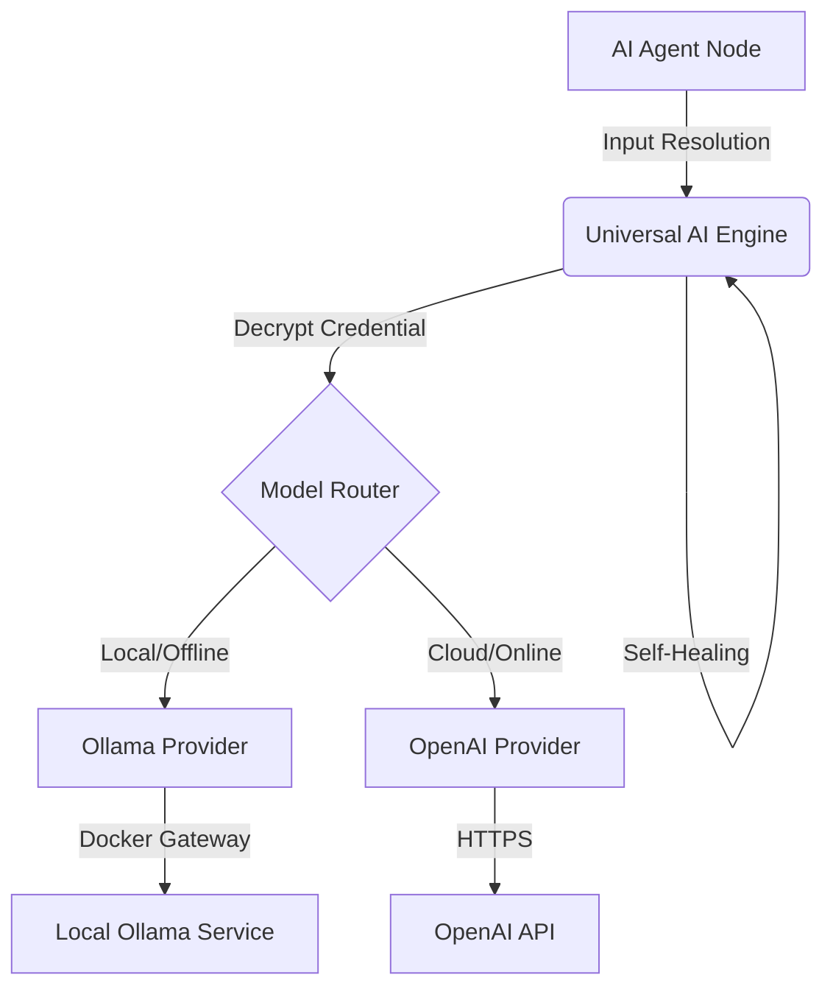

# AI Agent System Analysis

This document explains the inner workings of the **AI Agent (V2)** node in your FlowZen project.

## 1. High-Level Architecture

The AI Agent is not just a wrapper around an API call. It is a multi-layered system designed for **robustness**, **routing**, and **safety**.

## 2. Core Components

### 1. The Node (`ai_agent_node.py`)
**Role:** Interface & Input Processing.
*   **Location:** `Automation/backend/workflows/nodes/ai_agent_node.py`
*   **Key Logic:**
    *   **Dynamic Inputs:** Merges data from 'Handle' inputs (`main`, `system`, `memory`, `tools`).
    *   **Context injection:** Injects `IDENTITY` (Agent Name) and `CURRENT TIME` into the system prompt.
    *   **Execution:** Delegates everything to `UniversalAIEngine.run()`.

### 2. The Universal Engine (`universal_engine.py`)
**Role:** The "Brain" / Orchestrator.
*   **Location:** `Automation/backend/workflows/ai_providers/universal_engine.py`
*   **Key Features:**
    *   **Smart Routing:** Asks `select_model` which model/provider to use.
    *   **Resiliency:**
        *   **Retries:** Defaults to 3 retries with exponential backoff.
        *   **Self-Healing:** If JSON parsing fails, it automatically re-prompts the model with the error message to fix itself.
        *   **Fallback:** If a local model (Ollama) fails, it can silently switch to OpenAI (if a backup key is provided).
    *   **Memory Integration:** Retrieves relevant past context if a Memory store is configured.

### 3. The Router (`model_router.py`)
**Role:** Decision Maker.
*   **Location:** `Automation/backend/workflows/ai_providers/model_router.py`
*   **Logic:**
    *   **Profile-Based:** `fast` (Gemma/Phi), `accurate` (Llama3/GPT-4).
    *   **Task-Based:** Detects keywords like "plan" (logic) vs "write" (creative) to pick the best local model.
    *   **Safety:** Verifies that the selected model *actually exists* in your Ollama library to prevent "hallucinated model" errors.

### 4. The Local Provider (`ollama_provider.py`)
**Role:** Docker-Compatible Executor.
*   **Location:** `Automation/backend/workflows/ai_providers/ollama_provider.py`
*   **Docker Magic:**
    *   Connecting to `localhost` from *inside* a container is tricky.
    *   This provider automatically tries `host.docker.internal` and `172.17.0.1` (Docker Bridge) to ensure it can reach your host's Ollama instance.
*   **Strict Validation:** Calls `/api/tags` on Ollama to ensure the model requested is valid.

## 3. Execution Flow Example

1.  **User Input:** "Analyze this customer email."
2.  **Node:** Packs input + System Prompt ("You are a support agent") + Agent Name.
3.  **Engine:**
    *   Loads "Brain" credential.
    *   Checks logic: "Analyze" -> Needs reasoning -> Router selects `llama3:8b` (Local).
4.  **Provider:**
    *   Connects to `http://host.docker.internal:11434`.
    *   Sends prompt.
5.  **Result:**
    *   If successful, returns text/JSON.
    *   If Ollama crashes (e.g., Timeout), Logic -> **Failover** to OpenAI (if configured).

## 4. Key Files Summary

| Component | File |
| :--- | :--- |
| **Node** | `nodes/ai_agent_node.py` |
| **Engine** | `ai_providers/universal_engine.py` |
| **Router** | `ai_providers/model_router.py` |
| **Ollama** | `ai_providers/ollama_provider.py` |
