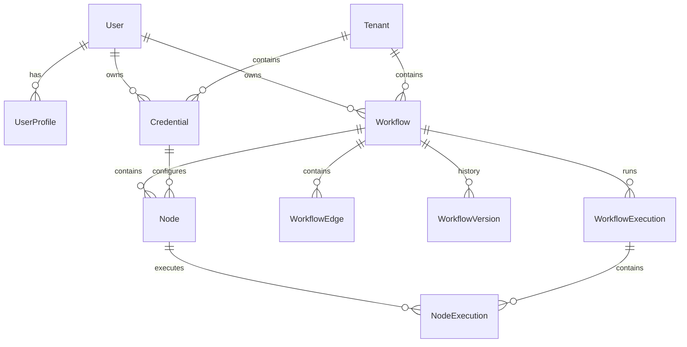

# Database Schema & Architecture Analysis

## Overview
FlowZen uses **PostgreSQL** as its primary data store, managed via the **Django ORM**. The database design employs a **Hybrid Relational/Document** approach, leveraging PostgreSQL's `JSONField` capabilities alongside strict relational constraints.

## 1. Core Data Models

### A. Workflow & Graph Structure
The storage of workflows is unique: it acts as a "Double Ledger".
1.  **`Workflow` Model**: Stores the high-level metadata (name, status) AND the entire valid graph structure in a `graph` JSONField.
2.  **`Node` & `WorkflowEdge` Models**: These are relational tables that shadow the contents of the `Workflow.graph` JSON.
    *   **Synchronization**: Logic in `WorkflowSerializer.update()` ensures that whenever the JSON graph is saved, the corresponding `Node` and `WorkflowEdge` records are created, updated, or deleted to match.
    *   **Purpose**: This allows the frontend to work with flexible JSON objects while the backend can perform efficient SQL queries, relational joins, and integrity checks on specific nodes without parsing giant JSON blobs.

**Key Field Mappings:**
| JSON Field (Frontend) | Node Model Field (Backend) | Purpose |
|-----------------------|----------------------------|---------|
| `id` | `node_id` | Unique identifier within the workflow graph |
| `type` / `action_type` | `action_type` | Defines execution logic (e.g., `http_request`, `ai_agent`) |
| `config` | `config` (JSON) | Node-specific settings (URL, prompts, etc.) |
| `position` | `position` (JSON) | UI coordinates (X, Y) |

### B. Execution History
The execution model is designed for high-write throughput and traceability.

1.  **`WorkflowExecution`**: Represents a single run of a workflow.
    *   **Trigger Tracking**: Stores what started the run (`manual`, `webhook`, `schedule`) and the input payload.
    *   **State**: Tracks `status`, `started_at`, `finished_at`.
    *   **Traceability**: Uses `correlation_id` to trace distributed tasks across Celery workers.

2.  **`NodeExecution`**: Tracks the execution of a single node.
    *   **Foreign Key**: Links specifically to the `Node` model (not just an ID string), enforcing referential integrity.
    *   **Data Flow**: Stores `input_data` and `output` as JSON.
    *   **Items (n8n-style)**: Newer fields `input_items` and `output_items` support array-based processing for batch operations.

### C. Authentication & Credential Security
Authentication uses a custom implementation on top of Django's User model.

1.  **`OTP`**: Handles passwordless authentication codes (hashed with SHA-256).
2.  **`Credential`**: Stores API keys and tokens.
    *   **Encryption**: Uses `django-encrypted-model-fields` (Fernet symmetric encryption) to ensure sensitive data (`api_key`, `access_token`) is encrypted at rest in the database.
    *   **Isolation**: Scoped to `Owner` and `Tenant`.

### D. Multi-Tenancy
The system implements logical isolation via the `Tenant` model.
*   **Workflow isolation**: `Workflow` has a `tenant` FK.
*   **Execution isolation**: `WorkflowExecution` has an explicit `tenant` FK (denormalized for query performance).
*   **Middleware**: `TenantIsolationMiddleware` ensures users only access resources belonging to their accessible tenants.

## 2. Entity Relationship Diagram (Conceptual)



## 3. Database Sync Mechanism (Critical Logic)
The synchronization logic resides in `backend/workflows/serializers.py`:

```python
# Simplified Logic
def update(self, instance, validated_data):
    # 1. Update Workflow JSON
    graph = validated_data.get("graph")
    instance.graph = graph
    
    # 2. Sync Nodes (Update/Create)
    for node_data in graph['nodes']:
        Node.objects.update_or_create(
            workflow=instance,
            node_id=node_data['id'],
            defaults={...} # config, label, type
        )
        
    # 3. Clean Orphans
    instance.nodes.exclude(node_id__in=graph_ids).delete()
    
    # 4. Nuclear Re-sync of Edges
    WorkflowEdge.objects.filter(workflow=instance).delete()
    WorkflowEdge.objects.bulk_create(new_edges)
```

## 4. Key Configuration (`settings.py`)
*   **Engine**: `django.db.backends.postgresql`
*   **Connection**: Configured via distinct environment variables (`DATABASE_NAME`, `DATABASE_USER`, `DATABASE_HOST`, etc.).
*   **Encryption**: `FIELD_ENCRYPTION_KEY` is required for decrypting Credential fields.

## 5. Migrations
The project uses standard Django migrations (`migrations/` folder) to propagate schema changes. Given the hybrid nature, adding a new "property" to a node does NOT usually require a migration (it typically goes into the `config` JSONField), but adding core structural capabilities (like "Retries") requires schema changes to the `Node` table.
