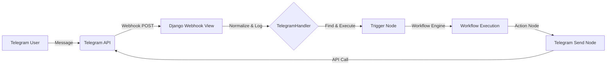

# Telegram System Analysis

This document details how Telegram integration works in your FlowZen project, covering both **Receiving** (Triggers) and **Sending** (Actions).

## 1. High-Level Architecture

The system acts as a bridge between Telegram's Webhooks and your Workflows.



## 2. Receiving Messages (The Trigger)

**Core Logic:** `Automation/backend/workflows/triggers/telegram_handler.py`

### Step 1: Webhook Ingestion
*   **Endpoint:** `/api/webhooks/telegram/`
*   **Security:**
    *   Validates `X-Telegram-Bot-Api-Secret-Token` header (must be `flowzen_secure_v1`).
    *   Extracts `token` from the URL query params to identify *which* bot is being addressed.

### Step 2: Normalization
*   The raw JSON from Telegram is strictly normalized into a flat structure:
    ```json
    {
      "text": "Hello bot",
      "clean_text": "Hello bot",
      "command": null,
      "chat_id": "123456789",
      "user_id": "987654321",
      "username": "jdoe",
      "is_group": false
    }
    ```

### Step 3: State Management
*   **Conversation Tracking:** Automatically creates or updates a `TelegramConversation` record in Postgres. This allows the system to remember users.
*   **Message Logging:** Saves the incoming payload to `TelegramMessage` for debugging and history.

### Step 4: Workflow Triggering
*   The handler queries for **active, published** workflows that contain a `TelegramTriggerNode` linked to the specific Bot Credential.
*   It launches a `WorkflowExecution` asynchronously via Celery (`execute_workflow_with_core_engine`).

## 3. Sending Messages (The Action)

**Core Logic:** `Automation/backend/workflows/nodes/telegram_send.py`

### Features
1.  **Smart Resolution:**
    *   If `chat_id` or `message` is missing, it intelligently looks into the *workflow context* (e.g., replying to the user who triggered the workflow).
2.  **Formatting:**
    *   Supports `Markdown` and `HTML`.
    *   **Auto-Retry:** If Telegram rejects the Markdown (common error), the node automatically strips formatting and retries as plain text to ensure delivery.
3.  **Chunking:**
    *   Telegram has a 4096 character limit. The node automatically splits long messages into multiple chunks to prevent errors.

## 4. Bot Registration

**Logic:** `telegram_register_view` in `telegram_handler.py`

*   Automates the `setWebhook` call to Telegram.
*   Ensures the webhook URL allows HTTPS.
*   Embeds the bot token into the webhook URL parameters for strict routing (e.g., `https://api.yoursite.com/...?token=123:ABC`).

## 5. Key Files Summary

| Component | File |
| :--- | :--- |
| **Sending Node** | `workflows/nodes/telegram_send.py` |
| **Trigger Node** | `workflows/nodes/telegram_trigger.py` |
| **Webhook Handler** | `workflows/triggers/telegram_handler.py` |
| **Models** | `TelegramConversation`, `TelegramMessage` (in `workflows/models.py`) |
