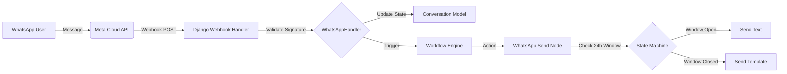

# WhatsApp System Analysis

This document details how Meta WhatsApp Cloud API integration works in your FlowZen project.

## 1. High-Level Architecture

The system is a "Stateful" integration that strictly manages the **24-hour Service Window** imposed by Meta.

## 2. Receiving Messages (The Trigger)

**Core Logic:** `Automation/backend/workflows/triggers/whatsapp_handler.py`

### Step 1: Webhook Ingestion
*   **Endpoint:** `/api/webhooks/whatsapp/` (Standard Meta Callback).
*   **Security:**
    *   **Verification:** Handles the `GET` request for the initial handshake (`hub.challenge`).
    *   **Signature:** strictly validates `X-Hub-Signature-256` using your App Secret.

### Step 2: Processing & Safety
*   **Normalization:** Extracts text, buttons, and media metadata.
*   **Safety Escalation:** Automatically flags "risky" media (Audio, Stickers, Documents) for **Human Takeover** if the bot is in auto-mode.
*   **Commands:** Listens for `/ai resume` to return control to the bot.

### Step 3: Workflow Triggering
*   Finds **Published Workflows** linked to the specific Phone Number ID.
*   injects a clean payload: `from`, `text`, `sender_name`, `wamid` (Message ID).

## 3. Sending Messages (The Action)

**Core Logic:** `Automation/backend/workflows/nodes/whatsapp_nodes.py`

### Feature 1: The 24-Hour Window Manager
*   Meta only allows free-form text messages within 24 hours of the *user's* last message.
*   **Logic:**
    1.  Checks `WhatsAppConversation` model for `last_user_message_at`.
    2.  If < 24h: Sends `text` message.
    3.  If > 24h: **Rejects** text messages unless you use a Template.

### Feature 2: Smart Fallback
*   If you try to send a Text message and Meta rejects it with error `131047` (Window Closed), the Node **automatically switches** to a fallback template (e.g., `order_confirmed` or `hello_world`) to ensure the user gets *something*.

### Feature 3: Limits & Quotas
*   **Soft Limit:** 900 conversations/month (Logs warning).
*   **Hard Limit:** 1000 conversations/month (Blocks sending).

## 4. Key Files Summary

| Component | File |
| :--- | :--- |
| **Sending Node** | `workflows/nodes/whatsapp_nodes.py` |
| **Trigger Node** | `workflows/triggers/whatsapp_trigger.py` |
| **Webhook Handler** | `workflows/triggers/whatsapp_handler.py` |
| **State Models** | `WhatsAppConversation`, `WhatsAppMessage` (in `models.py`) |
